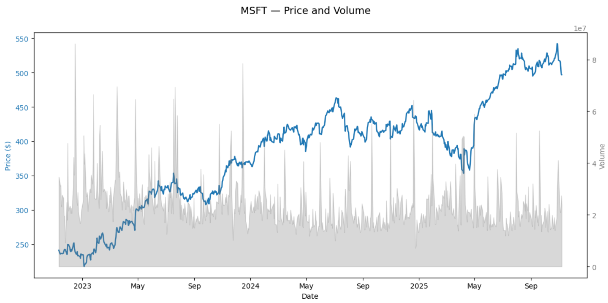
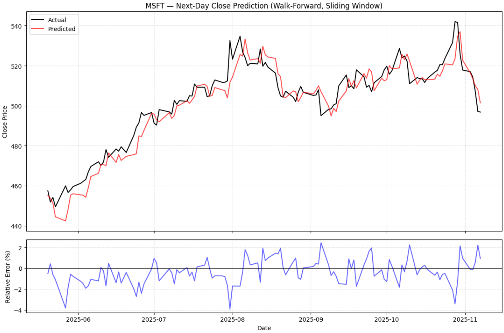
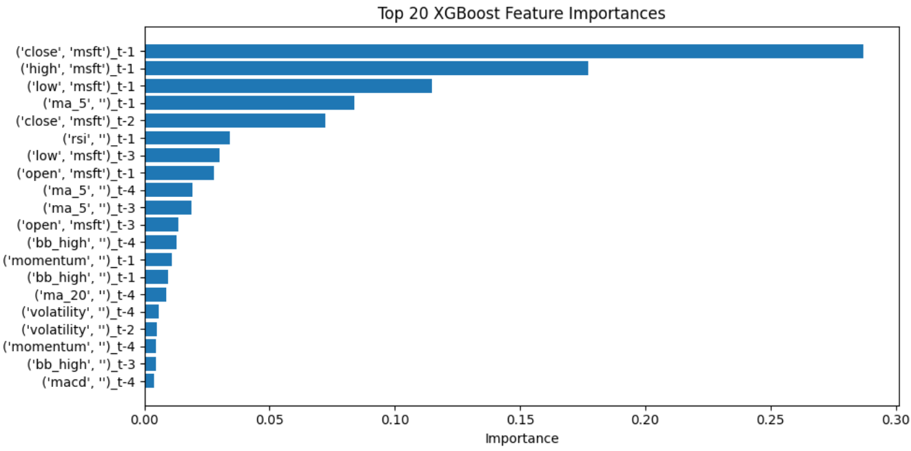

## Can Machine Learning Beat Market Noise?

Financial markets generate an enormous amount of data every day. For many individual investors, interpreting constant price movements and separating meaningful signals from noise can be challenging. While institutional traders rely on advanced algorithms and data-driven strategies, most retail investors do not have access to similar predictive tools.

This project explores how machine learning can help bridge that gap. The goal is to forecast the next-day performance of S&P 500 stocks using historical market data. The model is built with XGBoost, a gradient boosting algorithm well known for capturing complex, nonlinear relationships while maintaining good generalization performance. Its strong track record in time series forecasting makes it a natural choice for this task. The model was developed using a Jupyter Notebook, which is available [here](https://github.com/ruokokoski/predistocks/blob/main/stock_predictor_prod.ipynb).

In traditional investing, technical indicators such as moving averages, RSI, and MACD have long been used to identify trends and momentum. Their usefulness is still debated: some believe they reflect genuine patterns in market behavior, while others see them as artifacts of randomness. This project examines whether combining these common indicators with raw price and volume data can improve the predictive accuracy of a machine learning model.

The ultimate aim is not to produce perfect forecasts or guaranteed profits, but to improve decision-making through data-driven insights. By transforming historical market data into quantitative predictions, this approach offers investors a structured way to evaluate short-term price movements and identify potential opportunities and risks before the trading day begins.

### Collecting Data

Accurate and consistent historical data is the foundation of any stock forecasting model. Before building the model, I explored several data sources and APIs, including Yahoo Finance, Finnhub, and Tiingo. Each provides access to daily stock prices, but many require registration, authentication keys, or rate-limit management, which can slow down experimentation.

For this project, the `yfinance` library in Python turned out to be the most practical choice. It offers direct and reliable access to daily **Open, High, Low, Close, and Volume (OHLCV)** data for all S&P 500 companies. The setup is straightforward, with no API keys or authentication required, which makes it easy to collect and update stock data programmatically.

The stock data for a given ticker can be easily loaded directly from Yahoo Finance. The following function demonstrates how to retrieve daily OHLCV data using Python:

```python
import yfinance as yf

def load_stock_data(ticker, start_date, end_date):
    """
    Load daily stock data for a given ticker from Yahoo Finance.
    
    Parameters:
        ticker (str): Stock symbol, e.g., 'MSFT'
        start_date (str): Start date in 'YYYY-MM-DD' format
        end_date (str): End date in 'YYYY-MM-DD' format
    
    Returns:
        pandas.DataFrame: DataFrame containing Open, High, Low, Close, Volume
    """
    stock = yf.download(ticker, start=start_date, end=end_date)
    return stock

### Inspecting Data

After collecting the data, the next step is to inspect and clean it to make sure the model receives consistent and reliable input. This involves checking for missing values, understanding the range and distribution of prices and trading volumes, and identifying any outliers that could distort predictions.

For example, Microsoft (MSFT) stock data over the past three years was examined. The dataset contains 750 trading days with no missing values in the key columns — Open, High, Low, Close, and Volume — making it well-suited for modeling.

Descriptive statistics provide a quick overview of the data:

| Price  | Ticker | Count | Mean        | Std        | Min       | Max        |
|--------|--------|-------|------------|-----------|-----------|-----------|
| Close  | MSFT   | 750   | 384.8      | 79.5      | 217.5     | 542.1     |
| High   | MSFT   | 750   | 388.1      | 79.9      | 220.9     | 554.5     |
| Low    | MSFT   | 750   | 381.3      | 79.3      | 214.6     | 540.8     |
| Open   | MSFT   | 750   | 384.8      | 79.8      | 218.2     | 554.3     |
| Volume | MSFT   | 750   | 23,634,120 | 9,588,958 | 7,164,500 | 86,102,000 |


Visualizing the data also helps. Plotting closing prices (blue) alongside trading volumes (gray) reveals overall price trends and highlights days with unusually high or low trading activity. This makes it easier to spot patterns, trends, and anomalies before feeding the data into a model.



### Feature Engineering

Raw stock data alone is often not enough for accurate predictions. Before feeding it into a model, the data needs to be transformed into features that capture meaningful patterns for forecasting the next day’s price.

In this project, daily OHLCV data (Open, High, Low, Close, Volume) is processed so that information from previous days can help predict the next day’s closing price. Two approaches are explored:

1. Using lagged OHLCV values as features, which means including the previous day or several days of prices and volumes as input.

2. Augmenting the dataset with technical indicators, which are commonly used in trading analysis, to see if they improve predictive performance.

Technical indicators summarize price trends and market behavior over time. The model includes features such as:

- **Moving averages (MA)** to capture short-term trends

- **Relative Strength Index (RSI)** to indicate overbought or oversold conditions

- **Momentum** to track the speed of price changes

- **Volatility** measures to reflect price fluctuations

- **MACD** for trend-following signals

- **Bollinger Bands** to highlight deviations from typical price ranges

Including these indicators allows the model to leverage patterns that may not be obvious from raw OHLCV data alone, potentially improving its ability to forecast next-day prices.

### Model Training and Evaluation

With the features prepared, the next step is to train and evaluate the predictive model. The approach uses a rolling window of past data to predict the following day’s price. This “walk-forward validation” mimics real trading conditions, ensuring that the model only ever uses historical information, just like a trader would.

Different model configurations are tested, such as how many past days to use as input (the lag) and the size of the training window. There is no universal setting for these parameters because stocks behave differently. Highly volatile stocks may benefit from a shorter lag to capture rapid price changes, while more stable stocks might require longer windows to learn meaningful trends.

The model is evaluated both with raw OHLCV data and with additional technical indicators. Performance is measured using metrics like:

- **Mean Absolute Error (MAE)**

- **Mean Absolute Percentage Error (MAPE)**

- **Root Mean Squared Error (RMSE)**

- **R²**, which 

- **Directional Accuracy**, which shows how often the model correctly predicts the next day’s price movement

This testing process helps identify the best configuration for each stock before generating final predictions. While several years of historical data are collected, the actual next-day prediction only uses the most recent portion of data defined by the chosen training window. Longer histories are mainly used to compare different setups and find the optimal lag and window size.

For example, comparing configurations for Microsoft (MSFT) illustrates the effect of including technical indicators:

| Feature Set  | Lag | Training Window | MAE  | MAPE  | R²    | Directional Accuracy |
|-------------|-----|----------------|------|-------|-------|--------------------|
| Without TA  | 5   | 120            | 5.42 | 1.08% | 0.901 | 48.8%              |
| With TA     | 4   | 100            | 4.88 | 0.97% | 0.911 | 52.9%              |


Including technical indicators leads to modest but consistent improvements, with lower MAE and MAPE, slightly higher R², and better directional accuracy. This demonstrates that adding carefully selected technical features to raw OHLCV data can enhance predictive performance while keeping the model relatively simple.

To illustrate how optimal configurations differ between stocks, the table below summarizes the best-performing lag, training window, and resulting metrics for MAPE and directional accuracy (DA) for Microsoft (MSFT), Coca-Cola (KO), Johnson & Johnson (JNJ), and Palantir (PLTR). Optimization goal here is MAPE.

| Ticker | Lag | Training Window | Best MAPE | Best DA |
|--------|-----|----------------|-----------|---------|
| MSFT   | 4   | 100            | 0.9861%    | 52.94%  |
| KO     | 3   | 100            | 0.7505%    | 55.37%  |
| JNJ    | 2   | 80             | 0.9610%    | 53.52%  |
| PLTR   | x   | xx             | 0.xxxx%    | xx.xx%  |


### Hyperparameter Optimization

The model’s predictive performance can be further improved by tuning its hyperparameters using Optuna. Optuna systematically explores many combinations of parameters, evaluating each configuration with the walk-forward validation approach.

Different optimization goals can be targeted, such as minimizing MAE, MAPE, or maximizing directional accuracy (DA), depending on whether the focus is on precise price prediction or correctly forecasting the direction of price movement. By combining historical data, lagged features, and technical indicators, Optuna identifies the hyperparameter settings that offer the best balance of accuracy and robustness for each stock.

Several optimization objectives were considered:

- **MAPE (Mean Absolute Percentage Error)**: Measures prediction errors as a percentage, making it easy to compare across stocks with different price levels.

- **Combined MAPE + DA**: Balances both prediction accuracy and the correct direction of movement.

- **DA alone**: Focuses on predicting whether the stock will go up or down, without considering the magnitude of the error.

Optimizing for DA can sometimes conflict with minimizing MAPE. For example, a model may correctly predict that a stock will rise, but overestimate the size of the increase, resulting in a high MAPE. Conversely, a model could predict the price very accurately in magnitude but get the direction wrong if the actual change is small.

Since this is a regression model, it is fundamentally designed to predict numeric prices. Metrics like MAPE, MAE, or RMSE are therefore the natural focus. Optimizing for directional accuracy is indirect because the model is not explicitly trained as a classifier. If the main goal is predicting the **direction** rather than the exact price, a classification model (e.g., logistic regression, XGBoost classifier, or other tree-based classifiers) may be more appropriate.

The results for Microsoft (MSFT) under different optimization objectives are summarized below:

| Optimization Objective | Best MAPE | Best DA  |
|------------------------|-----------|----------|
| MAPE                   | 0.98607   | 52.94%   |
| MAPE + DA (combined)   | 0.94722   | 52.94%   |
| DA                     | 0.98031   | 58.82%   |

Optimizing for the combined **MAPE + DA** metric yields the lowest prediction errors, while optimizing solely for **directional accuracy** improves the model’s ability to correctly anticipate the direction of price movements.

A walk-forward plot can illustrate the model’s performance for MSFT:

- The **upper panel** compares predicted and actual next-day closing prices, showing how closely the model follows daily movements.  
- The **lower panel** displays the relative prediction error in percentage terms, providing insight into the model’s day-to-day accuracy.



### Feature Importance

To understand what drives the model’s predictions, feature importance analysis was performed using the trained XGBoost model. Each input, whether a lagged price, moving average, or technical indicator, is assigned a score that reflects its influence on the prediction of the next day's stock price. Looking at the most recent training window, short-term lagged prices, moving averages, and RSI consistently rank as the most influential features, while other indicators play a smaller role. A visualization of the top 20 features makes it easy to see which pieces of historical data the model relies on most.



Another way to refine the model is by pruning features with low importance scores. By removing features below a certain threshold and retraining the model, it’s possible to reduce noise and focus on the most meaningful inputs. This can improve interpretability and sometimes even predictive performance. However, choosing the right pruning threshold is itself an optimization challenge: too strict, and valuable information may be lost, too loose, and irrelevant features may remain.

### Conclusions

Predicting short-term stock prices is inherently difficult due to the noisy and stochastic nature of market time series. Using the XGBoost model developed in this project, typical next-day predictions achieved a **MAPE of around 1%** and a **directional accuracy of approximately 52%**. When the model was specifically optimized for directional accuracy, it reached **58%**, showing that it can capture short-term trends better than random guessing.

Incorporating **technical indicators** provided a small but consistent improvement in prediction quality. Errors were slightly reduced, the proportion of variance explained increased, and directional accuracy improved. This suggests that technical analysis features can provide valuable information beyond raw price and volume data for next-day forecasting.

While the results demonstrate that machine learning can offer useful insights beyond basic trading rules, the model still requires significant fine-tuning before it could be applied in a real trading environment. Hyperparameter optimization is computationally intensive, and each stock typically needs a tailored configuration. Overall, the model provides a solid foundation for next-day price prediction, but practical deployment would require further refinement and careful evaluation.

